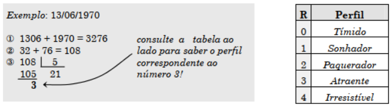

# Comandos de Decisão

## Sumário

 - [Expressões lógicas](#expressões-lógicas)
 - [Decisão Simples](#decisão-simples)
 - [Operador condicional (operador ternário)](#operador-condicional-operador-ternário)
 - [Condicionais aninhados e encadeados](#condicionais-aninhados-e-encadeados)
 - [Decisão múltipla (switch/case)](#decisão-múltipla-switchcase)
 - [Exercícios](#exercícios)
## Expressões lógicas

Em C não existe um tipo específica para valores lógicos (verdadeiro ou falso). Qualquer valor pode ser interpretado como um valor lógico:

**“zero representa falso e qualquer outro valor representa verdade”**

Por exemplo, os valores `5`, `-10`, `1.4` e `'b'` são verdadeiros, enquanto `0` e `(4 - 4)` são falsos.

Para gerar um valor lógico é necessário utilizar um operador relacional. A partir desse operador é possível comparar dois valores de formas diferentes. O resultado da avaliação de um operador relacional é 0 se a comparação é `falsa` e 1 se `verdadeira`. A Tabela a seguir mostra os operadores relacionais disponíveis na linguagem C.

| Operador relacional |              Resultado              |
|:-------------------:|:-----------------------------------:|
| x `==` y              | verdade se x for igual a y          |
| x `!=` y              | verdade se x for diferente de y     |
| x `<` y               | verdade se x for menor que y        |
| x `>` y               | verdade se x for maior que y        |
| x `<=` y              | verdade se x for menor ou igual a y |
| x `>=` y              | verdade se x for maior ou igual a y |

O trecho de código a seguir exibe os valores 1 (verdadeiro) e 0 (falso).

```C
printf("%d %d", 5 < 6, 6 < 5);
```

Além disso, na linguagem C também existem os operadores lógicos. A partir deles são criadas expressões lógicas compostas.

| Operador lógico |                  Resultado                  |
|:---------------:|:-------------------------------------------:|
| `!` x             | verdade se e somente se x for falso         |
| x `&&` y          | verdade se e somente se x e y forem verdade |
| x `\|\|` y        | verdade se e somente x ou y for verdade     |

## Decisão simples

A estrutura condicional, ou decisão simples, serve para escolher um entre dois comandos alternativos. A Figura a seguir mostra o fluxo de execução de um trecho de código que utiliza uma estrutura condicional.


Em C a estrutura condicional é codificada da seguinte forma:
```C
if (condição) {
  // comando 1;
} else {
  // comando 2;
}
```

A condição deve ser uma expressão lógica. Se a condição for verdadeira, o comando 1 é executado. Caso contrário, o comando 2 é executado. A parte `else` num comando `if` é opcional e pode ser omitida.

## Operador condicional (operador ternário)

C oferece um operador que proporciona uma forma mais compacta de se representar decisões simples. O operador condicional possui a sintaxe:

```C
condição ? expressão 1 : expressão 2;
```

A condição é avaliada. Caso for verdadeira, o resultado é o valor da expressão 1. Senão, o resultado é o valor da expressão 2.

```C
#include <stdio.h>

int main(void) { 
 int a, n = -10;
 a = n > 0 ? n : -n;
 printf("%d", a); 
}
```

Esse operador pode ser utilizado em qualquer contexto em que uma expressão é permitida.

## Condicionais aninhados e encadeados

A estrutura condicional serve para selecionar e executar um entre dois comandos alternativos. Em algumas vezes um destes comandos alternativos também podem ser condicionais. Dessa forma, o código poderia ficar estruturado da seguinte maneira:

```C
if ( condição 1 ) {
  // instruções...
  if ( condição 2 ) {
    // instruções...
  }
} else {
  // instruções
}
```

## Decisão múltipla (switch/case)

A estrutura de decisão múltipla é adequada quando precisamos escolher uma entre várias alternativas previamente definidas.

A decisão múltipla tem a seguinte forma:

```C
switch ( expressão ) {
  case constante 1:
    comando 1;
  break;
  case constante 2:
    comando 2;
  break;
  case constante n:
    comando n;
  default:
    comando
}
```

Nessa estrutura, a expressão é avaliada e deve ser um valor do tipo `char` ou `int`. É encontrado o case cuja constante é igual ao valor da expressão e executa todos os comandos seguintes até encontrar um comando `break`. Se não existe tal caso, executa as instruções associadas ao caso `default`.

O caso `default` é opcional e pode aparecer em qualquer posição entre os cases especificados. Além disso, se dois `case` não forem separados por um comando `break`, o controle “vaza” de um caso para outro.

Exemplo 1:
```C
#include <stdio.h>

int main() {
 float x, y;
 char op;
 printf("\n Expressão? ");
 scanf("%f %c %f", &x, &op, &y);
 switch( op ) {
   case '+': printf("\n valor = %.2f", x+y); break;
   case '-': printf("\n valor = %.2f", x-y); break;
   case '*': printf("\n valor = %.2f", x*y); break;
   case '/': printf("\n valor = %.2f", x/y); break;
   default : printf("\n Operador inválido: %c",op);
 }
}
```

Exemplo 2:
```C
#include <stdio.h>

int main() {
 int n;
 printf("\n Digite um número: ");
 scanf("%d", &n);
 switch( n ) {
   case 1: putchar('A'); break;
   case 3: putchar('B');
   case 4: putchar('C'); break;
   default: putchar('*');
   case 5: putchar('D');
 }
 putchar('.');
}
```

## Exercícios

1. Dado um número real qualquer, informe seu valor absoluto.

2. Uma empresa determinou um reajuste salarial de 5% a todos os seus funcionários. Além disso, concedeu um abono de R$ 100,00 para aqueles que recebem até R$ 750,00. Dado o valor do salário de um funcionário, informar para quanto ele será reajustado.

3. Seja `e` uma variável contendo o número de erros detectados num certo processo. Codifique uma instrução capaz de exibir saídas como:
```
1 erro detectado.
5 erros detectados.
```
Obs.: a variável `e` é lida pelo usuário.

4. Codifique uma instrução para exibir valores lógicos como `true` e `false`. Para o valor 0 deve aparecer `false` e para qualquer outro, `true`.

5. Dados três números, verifique se eles podem representar as medidas dos lados de um triângulo e, se puderem, classificar o triângulo em equilátero (3 lados iguais), isósceles (2 lados iguais) ou escaleno (3 lados diferentes).
   - `Propriedade`: o comprimento de cada lado de um triângulo é menor do que a soma dos comprimentos dos outros dois lados.
   - `Definição 1`: chama-se de triângulo equilátero o que tem os comprimentos dos três lados iguais;
   - `Definição 2`: chama-se de triângulo isóscele o triângulo que tem os comprimentos de dois lados iguais;
   - `Definição 3`: chama-se triângulo escaleno o triângulo que tem os comprimentos dos três lados diferentes.

6. Numa faculdade, os alunos com média pelo menos `7.0` são aprovados, aqueles com média inferior a `3.0` são reprovados e os demais ficam de recuperação. Dadas as duas notas de um aluno, informe sua situação. Faça um algoritmo que leia a média de um aluno e classifique a sua situação como `aprovado`, `reprovado` ou `recuperação`.

7. Dados a altura e o sexo de uma pessoa, determine seu peso ideal de acordo com as fórmulas a seguir:
   - para homens o peso ideal é `72.7 * altura - 58`;
   - para mulheres o peso ideal é `62.1 * altura - 44.7`.

8. O perfil de uma pessoa pode ser determinado a partir da sua data de nascimento, conforme exemplificado a seguir. Dada uma data de nascimento, informe o perfil correspondente.



9. Admitindo que uma data é lida pelo algoritmo em uma variável inteira, e não em uma variável do tipo data, crie um algoritmo que leia uma data no formato DDMMAA e imprima essa data no formato AAMMDD, onde:
   - A letra D corresponde a dois algarismos representando o dia; 
   - A letra M corresponde a dois algarismos representando o mês; 
   - A letra A corresponde aos dois últimos algarismos representando o ano.

10. Faça um algoritmo que leia dois números A e B e imprima o maior deles.

11. Faça um algoritmo que leia um número inteiro e indique se ele é par ou ímpar.

12. Faça um algoritmo que leia um número N e imprima “F1”, “F2” ou “F3”, conforme a condição: 
    - `F1`, se N <= 10
    - `F2`, se N > 10 e N <= 100 
    - `F3`, se n > 100

13. Construa um algoritmo que receba como entrada três valores e os imprima em ordem crescente.

14. Considere que o último concurso vestibular apresentou três provas: Português, Matemática e Conhecimentos Gerais. Construa um algoritmo que forneça: 
    1. a leitura das notas em cada prova do candidato;
    2. a média do candidato;
    3. uma informação dizendo se o candidato foi aprovado ou não. Considere que um candidato é aprovado se sua média for maior que 7.0 e se não apresentou nenhuma nota abaixo de 5.0.

15. Uma empresa de vendas tem três corretores. A empresa paga ao corretor uma comissão calculada de acordo com o valor de suas vendas. Se o valor da venda de um corretor for maior que R$ 50.000.00 a comissão será de 12% do valor vendido. Se o valor da venda do corretor estiver entre R$ 30.000.00 e R$ 50.000.00 (incluindo extremos) a comissão será de 9.5%. Em qualquer outro caso, a comissão será de 7%. Escreva um algoritmo que gere um relatório contendo o valor da venda e a comissão de cada um dos corretores. O relatório deve mostrar também o total de vendas da empresa.

16. Escreva um algoritmo que determine o número de dias que uma pessoa já viveu a partir da data de nascimento. Leia os valores para o dia, mês e ano de nascimento separadamente. Considere que um mês tenha 30 dias e o dia de nascimento e o dia atual fazem parte do total de dias vividos.

    - Ex.: Utilize os dados a seguir para validar o algoritmo desenvolvido:

|  Dia atual | Data de nascimento | Dias vividos |
|:----------:|:------------------:|:------------:|
| 27/08/2019 |     12/03/1990     | 10.606       |
| 27/08/2019 |     09/10/2000     | 6.799        |
| 15/09/2019 |     12/03/1990     | 10.624       |
| 15/09/2019 |     09/10/2000     | 6.817        |

17. Faça um algoritmo que leia os valores A, B e C. Mostre uma mensagem que informe se a soma de A com B é menor, maior ou igual a C.

18. Suponha que um caixa disponha apenas de notas de 1, 10 e 100 reais. Considerando que alguém está pagando uma compra, escreva um algoritmo que mostre o número mínimo de notas que o caixa deve fornecer como troco. Mostre também: o valor da compra, o valor do troco e a quantidade de cada tipo de nota do troco. Suponha que o sistema monetário não utilize moedas.

19. Escreva um algoritmo que, para uma conta bancária, leia o seu número, o saldo, o tipo de operação a ser realizada (depósito ou retirada) e o valor da operação. Após, determine e mostre o novo saldo. Se o novo saldo ficar negativo, deve ser mostrada, também, a mensagem “conta estourada”.

20. Um hotel cobra R$ 60.00 a diária e mais uma taxa de serviços. A taxa de serviços é de: 
    - R$ 5.50 por diária, se o número de diárias for maior que 15; 
    - R$ 6.00 por diária, se o número de diárias for igual a 15; 
    - R$ 8.00 por diária, se o número de diárias for menor que 15. 
- Construa um algoritmo que mostre o total da conta de um cliente.

21. Faça um algoritmo que leia 3 números inteiros distintos e escreva o menor deles.

22. Suponha que o conceito de um aluno seja determinado em função da sua nota. Suponha, também, que esta nota seja um valor inteiro na faixa de 0 a 100, conforme a seguinte faixa:

|   Nota   |   Conceito   |
|:--------:|:------------:|
|  0 a 49  | Insuficiente |
|  50 a 64 |    Regular   |
|  65 a 84 |      Bom     |
| 85 a 100 |     Ótimo    |

- Crie um algoritmo que apresente o conceito e a nota de um aluno.
