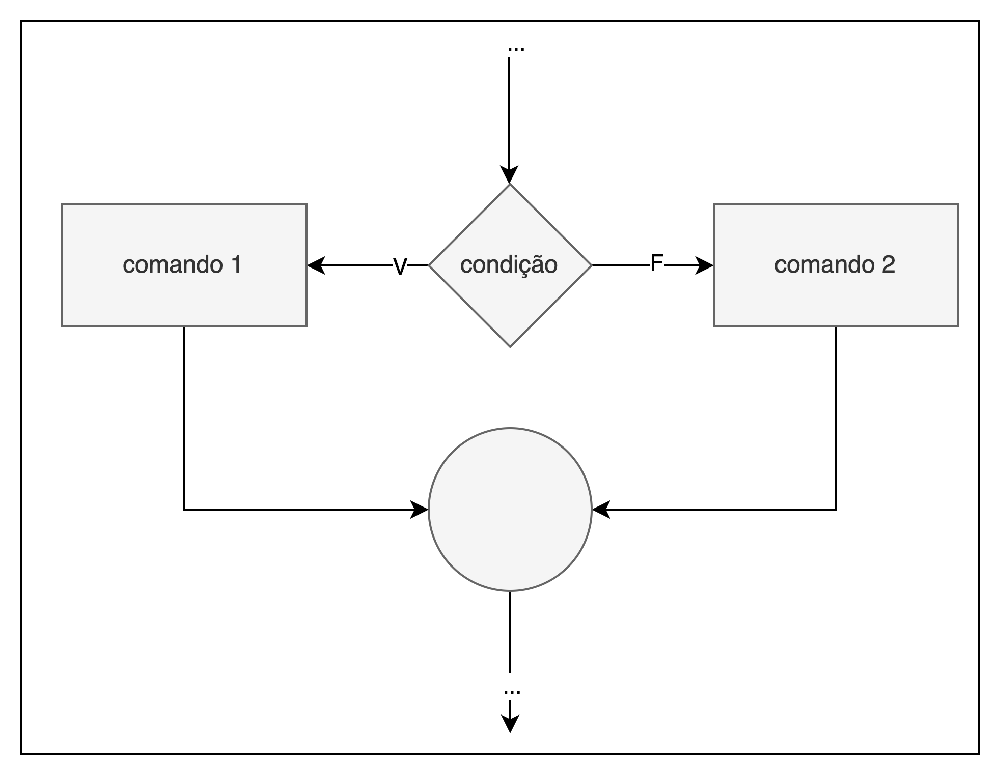

# Comandos de Decisão

## Sumário

 - [Expressões lógicas](#expressões-lógicas)
 - [Decisão Simples](#decisão-simples)
## Expressões lógicas

Em C não existe um tipo específica para valores lógicos (verdadeiro ou falso). Qualquer valor pode ser interpretado como um valor lógico:

**“zero representa falso e qualquer outro valor representa verdade”**

Por exemplo, os valores `5`, `-10`, `1.4` e `'b'` são verdadeiros, enquanto `0` e `(4 - 4)` são falsos.

Para gerar um valor lógico é necessário utilizar um operador relacional. A partir desse operador é possível comparar dois valores de formas diferentes. O resultado da avaliação de um operador relacional é 0 se a comparação é `falsa` e 1 se `verdadeira`. A Tabela a seguir mostra os operadores relacionais disponíveis na linguagem C.

| Operador relacional |              Resultado              |
|:-------------------:|:-----------------------------------:|
| x `==` y              | verdade se x for igual a y          |
| x `!=` y              | verdade se x for diferente de y     |
| x `<` y               | verdade se x for menor que y        |
| x `>` y               | verdade se x for maior que y        |
| x `<=` y              | verdade se x for menor ou igual a y |
| x `>=` y              | verdade se x for maior ou igual a y |

O trecho de código a seguir exibe os valores 1 (verdadeiro) e 0 (falso).

```C
printf("%d %d", 5 < 6, 6 < 5);
```

Além disso, na linguagem C também existem os operadores lógicos. A partir deles são criadas expressões lógicas compostas.

| Operador lógico |                  Resultado                  |
|:---------------:|:-------------------------------------------:|
| `!` x             | verdade se e somente se x for falso         |
| x `&&` y          | verdade se e somente se x e y forem verdade |
| x `\|\|` y        | verdade se e somente x ou y for verdade     |

## Decisão simples

A estrutura condicional, ou decisão simples, serve para escolher um entre dois comandos alternativos. A Figura a seguir mostra o fluxo de execução de um trecho de código que utiliza uma estrutura condicional.

