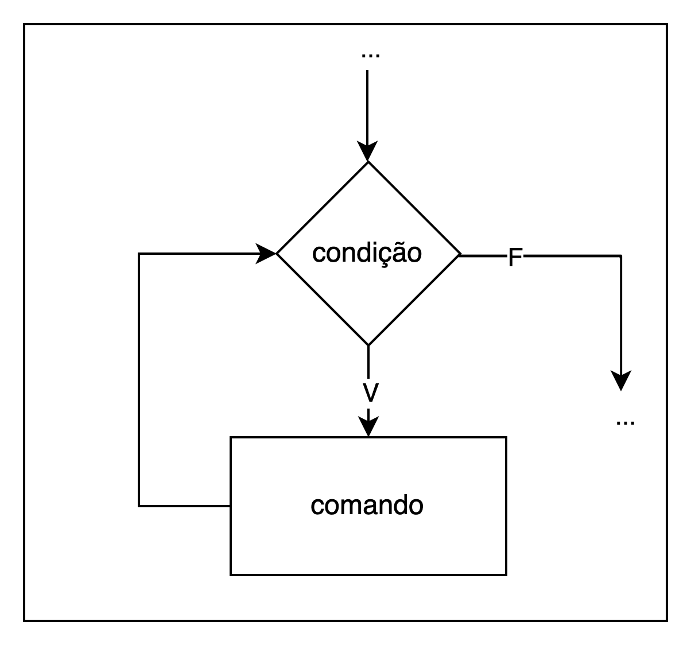

# Comandos de Repetição

## Sumário

- [Expressões compactas](#expressões-compactas)
- [Operadores aritméticos de atribuição](#operadores-aritméticos-de-atribuição)
- [Incremento e Decremento](#incremento-e-decremento)
- [Repetição com contador](#repetição-com-contador)
- [Repetição com precondição](#repetição-com-precondição)
- [Exercícios](#exercícios)
## Expressões compactas

Em várias situações há a necessidade de escrever expressões da forma `var = var operador expressão` (ex.: x = x + 2;). Para simplificar a escrita de código, existe um grupo especial de operadores de atribuição que simplifica a linha de código.

## Operadores aritméticos de atribuição

Os operadores aritméticos de atribuição combinam uma operação aritmética e uma atribuição. Por exemplo, a expressão `x = x + 3` pode ser escrita como `x += 3`. O operador `+=` adicionar o valor da expressão à sua direita ao valor da variável à sua esquerda e armazena o resultado nessa mesma variável.

A Tabela a seguir mostra a relação dos operadores aritméticos de atribuição:

| Expressão | Forma compacta |
|:---------:|:--------------:|
| x = x + y |     x += y     |
| x = x - y |     x -= y     |
| x = x * y |     x *= y     |
| x = x / y |     x /= y     |
| x = x % y |     x %= y     |

## Incremento e Decremento

Se uma expressão incrementa ou decrementa o valor da variável, podemos escrevê-la de uma forma mais compacta. Para incrementar usamos o operador `++` e para decrementar usamos o operador `--`. Esses operadores podem ser usados tanto na forma prefixa quanto posfixa.

- forma prefixa: `++variável`, `--variável`;
- forma posfixa: `variável++`, `variável--`.

Exemplo:
```C
#include <stdio.h>

int main(void) {
 int x = 5, y = 5;
 ++x;
 y--;
 printf("x = %d y = %d", x, y);
}
```

A saída produzida pelo código acima será `x = 6 y = 4`. A diferença entre usar um operador na forma prefixa ou posfixa ocorre quando ele é utilizado numa expressão juntamente com outros operadores.

Na forma prefixa, a variável é alterada e, depois, seu valor é usado. Na forma posfixa, o valor da variável é usado e, depois, ela é alterada.

Exemplo:
```C
#include <stdio.h>

int main(void) {
 int x = 5, y = 5, v, w;
 v = ++x;
 w = y--;
 printf("x = %d y = %d v = %d w = %d", x, y, v, w);
}
```

A saída produzida pelo código será `x = 6 y = 4 v = 6 w = 5`.

## Repetição com contador

A estrutura de repetição com contador tem seu funcionamento controlado por uma variável que conta o número de vezes que o comando é executado. Na linguagem C, essa estrutura é implementada pelo comando `for`, que tem o formato:

```C
for(inicialização; condição de permanência; alteração) comando;
```

A **inicialização** é uma expressão que atribui um valor inicial ao contador, a **condição de permanência** verifica se a contagem chegou ao fim e a **alteração** modifica o valor do contador. O funcionamento dessa estrutura é ilustrado na figura a seguir:


O exemplo a seguir mostra um programa que faz uma contagem de 1 até 10:

```C
#include <stdio.h>

int main(void) {
 int c;
 for (c = 1; c <= 5; c++) {
   printf("%d ", c);
 }
}
```

O próximo exemplo exibe a tabuada de um número inteiro:

```C
// EXIBE A TABUADA DE UM NÚMERO INTEIRO
#include <stdio.h>

int main(void) {
 int n, c, r;
 printf("Digite um número entre 1 e 10: ");
 scanf("%d", &n);
 for (c = 1; c <= 10; c++) {
   r = c * n;
   printf("%d x %d = %d\n", n, c, r);
 }
}
```

O comando `if` pode ser utilizado dentro do comando `for`.

```C
// EXIBE OS NÚMEROS PARES ENTRE 1 E 100
#include <stdio.h>

int main(void) {
 int c;
 for (c = 1; c <= 100; c++) {
   if (c % 2 == 0) {
     printf("%d\n", c);
   }
 }
}
```

Da mesma forma, o comando `for` pode ser aninhado dentro de outro `for`. O exemplo a seguir exibe um tabuleiro de xadrez cujo tamanho é indicador pelo usuário. Para determinar a cor dos quadros do tabuleiro, basta observar a figura a seguir que os quadros brancos correspondem a posições cuja soma de suas coordenadas é par e aqueles de cor preta, as posições cuja soma é ímpar.

```C
#include <stdio.h>

int main(void) {
 int n, l, c;
 char cor;
 printf("Qual o tamanho do tabuleiro? ");
 scanf("%d", &n);
 for (l = 0; l < n; l++) {
   for (c = 0; c < n; c++) {
     if ((l + c) % 2 == 0) {
       cor = '#';
     } else {
       cor = ' ';
     }
     printf("%c ", cor);
   }
   printf("\n");
 }
}
```

## Repetição com precondição

É uma estrutura de repetição mais genérica, na linguagem C, possui a seguinte forma:

```C
while (condição) comando;
```

Essa estrutura é controlada por uma expressão lógica, que é a condição de permanência no laço de repetição. A Figura a seguir mostra o funcionamento dessa estrutura:



A repetição por precondição é mais adequada em situações em que não é possível determinar o número de repetições a ser executada. Assim, a permanência no laço de repetição é definida a partir de fatores como entrada de dados ou expressões aritméticas.

Para exemplificar esse cenário, o código a seguir resolve o problema para exibir todos os dígitos de um número natural.

```C
#include <stdio.h>

int main(void) {
 int n;
 printf("Digite um número: ");
 scanf("%d", &n);
 while (n != 0) {
   printf("%d\n", n % 10);
   n = n / 10;
 }
}
```

## Exercícios

1. Explique por que motivo a expressão `x = x * 2 + y` não pode ser escrita como `x *= 2 + y`.

2. Elabore um algoritmo que imprima todos os números de 250 a 500.

3. Dado um valor n, exiba uma contagem regressiva de `n` até 0.

4. Elabore um algoritmo que leia um número de entrada que indicará a quantidade de números a serem lidos. Em seguida, leia n números (conforme o valor informado anteriormente) e imprima o triplo de cada um.

5. Exiba uma tabela de conversão de polegadas em centímetros, variando as polegadas de 0 a 10 de meio em meio. (Considere: 1” ~ 2.54 cm)

6. Dados um número real x e um natural n, exiba a potência `x^n` (x elevado a n).

7. Dados um número natural n, exiba o valor de seu fatorial `n!`.

8. Elabore um algoritmo que imprima todos os números de 100 a 200, e ao final a soma deles.

9. O quadrado de um número natural n é dado pela soma dos n primeiros números ímpares consecutivos. Por exemplo, `1^2 = 1`, `2^2 = 1 + 3`, `3^2 = 1 + 3 + 5`, `4^2 = 1 + 3 + 5 + 7`, etc. Dado um número `n`, calcule seu quadrado usando a soma de ímpares ao invés de produto.

10. Elabore um algoritmo que leia a idade e sexo de 10 pessoas. Imprimir `OK`, se a pessoa for do sexo masculino e tiver mais do que 21 anos.

11. A série de __Fibonacci__ é `1, 1, 2, 3, 5, 8, 13, 21, 34, 55, ...`. Os dois primeiros termos são iguais a 1, a partir do terceiro, o termo é dado pela soma dos dois termos anteriores. Dado um número `n >= 3`, exiba o n-ésimo termo da série de __Fibonacci__.

12. Elabore um algoritmo que leia 10 números, e imprima quantos números maiores que 30 foram digitados.

13. Elabore um algoritmo que leia 10 números e imprima quantos são pares e quantos são ímpares.

14. Elabore um algoritmo que leia um número e imprima a soma dos números múltiplos de 5 no intervalo entre 1 e o número informado. Suponha que o número lido será maior que zero.

15. Um mês antes das eleições municipais, um determinado partido político encomendou uma pesquisa de opinião sobre as intenções de votos dos eleitores. Foram entrevistadas 20 pessoas que indicaram suas intenções de acordo com as seguintes opções: (A) candidato A, (B) candidato B ou (C) indeciso. Desenvolva um algoritmo que faça a leitura das intenções de votos dessas 20 pessoas e que informe ao final a porcentagem de intenções para cada uma das opções existentes (candidatos A e B, e indecisos).

16. Elabore um algoritmo que leia 5 números, e ao final, imprima a média desses números.

17. Dados dois números naturais `m` e `n`, exiba um retângulo com `m` caracteres de altura e `n` caracteres de largura. Por exemplo, se forem dados os números 3 e 6, deverá ser exibido o seguinte desenho:

```bash
######
######
######
```

18. Elabore um algoritmo que leia um número de entrada que indicará a quantidade de números a serem lidos. Em seguida, leia n números (conforme o valor informado anteriormente) e, ao final imprima o maior número digitado. 

19. Elabore um algoritmo que leia um número de entrada que indicará a quantidade de números a serem lidos. Em seguida, leia n números (conforme o valor informado anteriormente) e, ao final imprima o menor número digitado.

20. Desenvolva um algoritmo que calcule as tabuadas dos números divisíveis por 2
que encontram-se no intervalo entre 1 e 10.  

21. Desenvolva um algoritmo que calcule o valor de `π` a partir da seguinte expressão matemática:  

```math
\pi=4\sum_{k=0}^{n}(-1)^{k}(\frac{1}{2k+1})
```

onde `n` deve ser informado pelo usuário e corresponde ao grau de precisão no cálculo do valor de `π`.  

22. Desenvolva um algoritmo para calcular e imprimir o valor de S na expressão a seguir:

```math
S=\frac{1}{1}-\frac{3}{2}+\frac{5}{3}-\frac{7}{4}+...-\frac{99}{50}
```

23. Desenvolva um algoritmo capaz de calcular o resultado da seguinte expressão aritmética, onde o valor de n é informado pelo usuário:  

```math
S_{n} = 1^{1} + 2^{2} + 3^{3} + ... + n^{n}
```

24. Faça um algoritmo que leia um conjunto indeterminado de números (X) e imprima a soma e a média desses números. Admita que o valor 9999 seja utilizado como mecanismo para o fim da leitura.

25. Faça um algoritmo que leia um conjunto indeterminado de dados numéricos (X) e imprima o maior número dentre eles. Admita que o valor 9999 seja utilizado como mecanismo para o fim da leitura.

26. Faça um algoritmo que leia dois números inteiros x e y positivos e imprima o quociente e o resto da divisão de x por y utilizando apenas as operações de adição e subtração.

27. Faça um algoritmo que leia um conjunto indeterminado de números (X) e imprima a quantidade de números pares e a quantidade de números ímpares lidos. Admita que o valor 9999 seja utilizado como mecanismo para o fim da leitura.

28. Numa certa agência bancária, as contas são identificadas por números de até seis dígitos seguidos de um dígito verificador, calculado conforme  exemplificado  a  seguir.  Dado  um  número  de  conta  n,  exiba  o número de conta completo correspondente. 

Ex.: Seja n = 7314 o número da conta.

- Adicionamos os dígitos de n e obtemos a soma s = 4+1+3+7 = 15; 
- Calculamos o resto da divisão de s por 10 e obtemos o dígito d = 5. 

Número de conta completo: `007314−5`

29. Um  número  natural  é  triangular se  é  igual  à  soma  dos  n primeiros números naturais consecutivos, a partir de 1. Por exemplo,  1,  3,  6, 10, 15, ... são triangulares. Dado um natural n ≥ 1, informe se ele é triangular.

30. Dada uma série de números positivos (finalizada com um valor igual a zero) que  representam as idades das pessoas que moram num certo bairro, determine a idade da pessoa mais nova e a da pessoa mais velha.

31. Um  comerciante  precisa  informatizar  o  caixa  de  sua loja. Para isso ele precisa de um programa que leia uma série de valores correspondendo aos preços das mercadorias compradas por um cliente (o valor zero finaliza  a  entrada),  calcule  o  valor  total,  subtraia  deste  valor  o  desconto devido  (vide  tabela  ao  lado)  e,  finalmente,  mostre  o  valor  a  ser  pago  pelo cliente. Codifique esse programa.

|        Total       | Desconto |
|:------------------:|:--------:|
| abaixo de R$ 50,00 |    5%    |
|    até R$ 100,00   |    10%   |
|    até R$ 200,00   |    15%   |
| acima de R$ 200,00 |    20%   |

32. Faça um programa que calcule o saldo de uma conta bancária tendo como entrada o saldo inicial e uma série  de operações de crédito e/ou débito finalizada com o valor zero. O programa deve apresentar como saída o total de créditos, o total de débitos, a  CPMF paga (0,35% do total de débitos) e o saldo final. Veja um exemplo:


33. Faça um algoritmo que converta um número da base 10 para a base X utilizando o método das divisões sucessivas. X deve ser informado pelo usuário.

34. Faça um algoritmo que converta um número da base X para a base 10 utilizando o método do polinômio. X deve ser informado pelo usuário.

35. Chico tem 1,50 metros e cresce 2 centímetros por ano, enquanto Zé tem 1,10 metros e cresce 3 centímetros por ano. Construa um algoritmo que calcule e imprima quantos anos serão necessários para que Zé seja maior que Chico.

36. Foi feita uma pesquisa entre os habitantes de uma região. Foram coletados os dados de idade, sexo (0 para masculino e 1 para feminino) e salário. Faça um algoritmo que informe: 
    1. a média de salário do grupo; 
    2. a maior e a menor idade do grupo; 
    3. a quantidade de mulheres com salário até R$100,00. 
Encerre a entrada de dados quando for digitada uma idade negativa.

37. Faça um algoritmo que leia um número inteiro n, calcule e mostre o maior quadrado menor ou igual a n. Por exemplo, se n for igual a 38, o menor quadrado é 36 (quadrado de 6).
