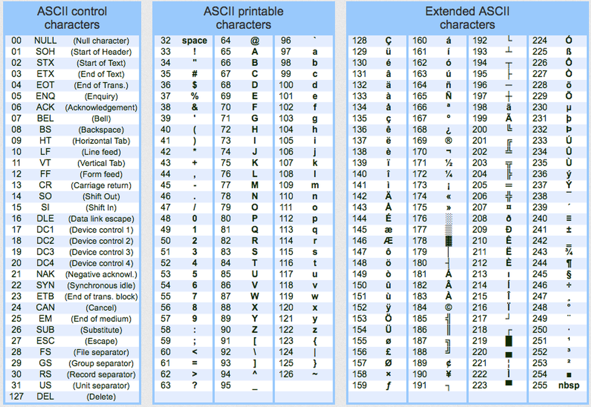

# Vetores, Strings e Matrizes

## Sumário

- [Vetores](#vetores)
- [Strings](#strings)
  - [Leitura e Escrita de Strings](#leitura-e-escrita-de-strings)
  - [Manipulação de Strings](#manipulação-de-strings)
- [Matrizes](#matrizes)
- [Exercícios](#exercícios)
  - [Vetores](#vetores-1)
  - [Strings](#strings-1)
  - [Matrizes](#matrizes-1)
## Vetores

Um vetor é uma coleção de variáveis de um mesmo tipo, que compartilham o mesmo nome e que ocupam posições consecutivas de memória. Cada uma dessas variáveis denomina-se elemento e é identificada por um índice. Se `v` é um vetor com `n` posições, seus elementos são `v[0], v[1], v[2], …, v[n - 1]`. A Figura a seguir mostra a estrutura de um vetor e os seus elementos.


Na linguagem C os vetores são sempre indexados a partir da posição zero e o último elemento de um vetor de tamanho `n` ocupa a posição `n - 1` do vetor. Para criar um vetor, declare uma variável com o sufixo `[n]`, sendo n uma constante indicando o número de elementos a serem alocados no vetor.

O exemplo a seguir mostra a declaração de um vetor `v` de tamanho cinco. Assim, é feita a leitura das cinco posições e em seguida é realizado o cálculo do somatório dos valores armazenados nesse vetor.


```C
#include <stdio.h>

int main(void) {
 int v[5], c, soma = 0;
 for (c = 0; c < 5; c++) {
   printf("Informe um valor para a posição %d: ", c);
   scanf("%d", &v[c]);
   soma += v[c];
 }
 printf("O valor do somatório dos elementos é: %d", soma);
}
```

## Strings

Na linguagem C uma String não é um tipo de dados básico. Uma string é uma série de caracteres terminada com um caractere representado por `'\0'`. Um vetor de caracteres é utilizado para representar uma string. Essa representação possibilita que os caracteres que formam um string sejam acessados individualmente.

A Figura a seguir mostra a representação de uma string com o valor `verde e amarelo`.


Devido à necessidade do `'\0'`, os vetores que armazenam strings devem ter sempre uma posição a mais do que o número de caracteres a serem armazenados.

### Leitura e Escrita de Strings

Para ler o valor de uma string utiliza-se a função `fgets(variável, tamanho, stdin)` da biblioteca `stdlib.h`. A exibição de uma string pode ser feita a partir do especificador `%s` na função `printf()`. O exemplo de código a seguir mostra as ações de declaração, leitura e escrita de uma string de tamanho 20.

```C
#include <stdio.h>

int main(void) {
 char p[20];
 printf("Informe uma cadeia de caracteres: ");
 fgets(p, 20, stdin);
 printf("A string informada foi: %s", p);
}
```

### Manipulação de Strings

Como a string não é um tipo básico da linguagem C, operações como atribuição e comparação não podem ser feitas diretamente com os operadores disponíveis. A partir dessa premissa a linguagem C possui uma biblioteca própria para realizar as operações em strings. Essa biblioteca é a `string.h`.

| Função                        | Significado                                                                    |
|-------------------------------|--------------------------------------------------------------------------------|
| `fgets(string, tamanho, stdin)` | Lê uma string                                                                  |
| `strcmp(string1, string2)`      | Compara duas strings. Se `strcmp(string1, string2) == 0`, então elas são iguais. |
| `strcpy(destino, origem)`       | Copia uma string para outra                                                    |
| `strlen(string)`                | Calcula o tamanho da string                                                    |
| `strcat(destino, origem)`       | Concatena duas strings                                                         |
| `strtok(string, “\n”)`          | Remove o caractere de nova linha                                               |

O código a seguir mostra exemplos de uso para as funções listadas na tabela anterior.

```C
#include <stdio.h>
#include <string.h>

int main(void) {
 char x[20], y[20];
 int i;
 printf("Informe uma string: ");
 fgets(x, 20, stdin); 
 // Compara se a string digitada é igual a "sim"
 if (strcmp(x, "sim")) {
   printf("A string digitada é %s", x);
 }
 // Copiar uma string para outra
 strcpy(y, x);
 printf("String copiada: %s", y);
 // Obter o tamanho da string
 printf("Tamanho da string: %ld", strlen(x));
 // Concatenar string
 strcat(x, " teste");
 printf("%s", x);
}
```

## Matrizes

Uma matriz é uma coleção homogênea bidimensional no qual os elementos são distribuídos em linhas e colunas. Se `A` é uma matriz `m x n`, então as suas linhas são indexadas de `0` a `m - 1` e as suas colunas de `0` a `n - 1`.	Para acessar um elemento de `A`, utiliza-se `A[i][j]`, sendo que `i` é o índice da linha e `j` o índice da coluna que o elemento ocupa.

O código do exemplo a seguir mostra a declaração de uma matriz `3 x 2`, a leitura e a impressão de todos os elementos dessa matriz:

```C
#include <stdio.h>

int main(void) {
 int a[3][2];
 int i, j;
 for (i = 0; i < 3; i++) {
   for (j = 0; j < 2; j++) {
     printf("a[%d][%d]: ", i, j);
     scanf("%d", &a[i][j]);
   }
 }
 for (i = 0; i < 3; i++) {
   for (j = 0; j < 2; j++) {
     printf("%d\t", a[i][j]);     
   }
   printf("\n");
 }
}
```

## Exercícios

### Vetores

1. Codifique um programa para solicitar 5 números, via teclado, e exibi-los na ordem inversa àquela em que foram fornecidos.

2. Crie um programa que armazene 10 números em um vetor A, e gere um vetor B onde cada elemento é o quadrado do elemento de A.

3. Dadas as temperaturas registradas diariamente, durante uma semana, determine em quantos dias a temperatura esteve acima da média.

4. Faça um algoritmo que copie o conteúdo de um vetor em um segundo vetor.

5. Faça um algoritmo que some o conteúdo de dois vetores e armazene o resultado em um terceiro vetor.

6. Faça um algoritmo que leia um vetor de 5 posições e copie os elementos para um novo vetor na ordem inversa.

7. Faça um algoritmo que faça a união de dois vetores de mesmo tamanho e mesmo tipo em um terceiro vetor com dobro do tamanho.

8. Escrever um algoritmo que lê um vetor N(10) e o escreve. Troque, a seguir, o 1º elemento com o último, o 2º com o penúltimo etc. até o 5º com o 6º e escreva o vetor N assim modificado.

9. Fazer um algoritmo que leia duas variáveis compostas unidimensionais, contendo, cada uma, 5 elementos inteiros. Intercale os elementos destes dois conjuntos formando uma nova variável composta unidimensional de 10 elementos. Escreva o novo conjunto obtido.

10. Uma certa fábrica produziu dois tipos de motores M1 e M2 nos meses de janeiro até dezembro e o número de motores produzidos foi registrado na tabela a seguir:


O setor de controle de vendas tem uma tabela do custo e do lucro (em unidades monetárias) obtidos com cada motor.


Para saber o custo e o lucro dos meses de janeiro até dezembro, basta que se faça o produto matricial das duas tabelas.


Faça um algoritmo que, a partir da produção mensal de motores M1 e M2 e seus respectivos custos e lucros, calcule o custo e o lucro em cada um dos meses e o custo e o lucro anuais.

11. Desenvolva um programa que solicite a idade e o sexo de 10 pessoas e armazene esses dados em vetores. O programa deve oferecer um menu que permita ao usuário as seguintes opções:
    1. Informar os dados das 10 pessoas.
    2. Sair

- Após o usuário ter informado os dados das 10 pessoas (caso a opção 1 seja selecionada), o programa deve oferecer as seguintes opções em um segundo menu:

    1. Consultar a idade do homem mais idoso
    2. Consultar a média das idades das mulheres
    3. Sair

A cada consulta realizada o programa deverá apresentar novamente o menu com as opções disponíveis e só deverá ser encerrado quando o usuário escolher a opção Sair.

12. Desenvolva um algoritmo que ofereça ao usuário as seguintes opções:
    1. Inserir números inteiros em um vetor de até 10 posições. Os números devem ser inseridos de modo que o vetor nunca fique desordenado (em nenhum momento). Ao se tentar inserir um número em um vetor cheio o programa deve acusar que não será possível realizar a inserção. Após a inserção, o algoritmo deve imprimir a quantidade de elementos do vetor e os respectivos elementos.
    2. Excluir um elemento do vetor a partir de seu valor. O usuário deverá entrar com o número que deseja excluir do vetor e o mesmo deverá ser retirado. Os demais elementos que se localizam após o elemento excluído devem ser realocados para suas novas posições. O algoritmo deve informar quando não existirem mais elementos para excluir.
    3. Imprimir na tela os elementos do vetor em ordem `CRESCENTE`.
    4. Imprimir na tela os elementos do vetor em ordem `DECRESCENTE`.
    5. Sair do programa.
    - Obs: O objetivo do item 1 não é o de ordenar o vetor, mas sim de manter o vetor ordenado a cada inserção, sendo assim, o vetor nunca chegará a estar desordenado, ou seja, antes de inserir cada elemento, o algoritmo deve procurar em qual posição o mesmo deve ser inserido, e depois realizar a inserção exatamente naquela posição.

### Strings

13. Sem utilizar a função `strcpy`, codifique um programa que faça a cópia de uma string de uma variável para outra.

14. Sem utilizar a função `strlen`, codifique um programa que calcule a quantidade de caracteres válidos de uma string.

15. Codifique um programa que converta todos os caracteres de uma string para letras maiúsculas. 

Obs.: um caractere pode ser representado por um número do tipo inteiro, utilize a máscara `%d` para exibir um caractere. Note que existe uma relação entre as letras maiúsculas e minúsculas.



16. Codifique um programa que converta todos os caracteres de uma string para letras minúsculas. Obs.: um caractere pode ser representado por um número do tipo inteiro, utilize a máscara %d para exibir um caractere. Note que existe uma relação entre as letras maiúsculas e minúsculas.

17. Codifique um programa que leia uma string e mostre se existe a letra ‘j’ nessa string. Caso exista, mostre qual é a posição da primeira ocorrência desse caractere.

18. Escreva um programa para ler uma string qualquer e exiba as seguintes informações: quantidade de caracteres, primeira e última letra.

19. Escreva um programa para ler uma frase de no máximo 70 caracteres e exibir a quantidade de vogais dessa frase.

20. Escreva um programa para ler uma frase de no máximo 70 caracteres e exibir a quantidade de consoantes dessa frase.

21. Escreva um programa que leia uma string qualquer e mostre-a invertida. 
```bash
Ex.: 
Entrada: CASA
Saída: ASAC
```

22. Um palíndromo é uma cadeia de caracteres que representa a mesma palavra nos sentidos direto e inverso. Por exemplo, “asa” é um palíndromo, porque o inverso dela também é “asa”. Faça um programa que leia uma string e diga se esta é ou não um palíndromo.

23. Escreva um programa que leia uma frase e mostre quantas letras “a” ou “A” foram digitadas.

24. Faça um programa que leia uma string com letras minúsculas e converta todas as consoantes para maiúsculas.

25. Faça um programa que leia uma string com letras minúsculas e converta todas as vogais para maiúsculas.

### Matrizes


[Voltar](../)