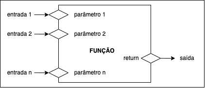

# Funções

## Sumário
- [Introdução](#introdução)
- [Funções que não devolvem resposta](#funções-que-não-devolvem-resposta)
- [Funções que devolvem resposta](#funções-que-devolvem-resposta)
- [Exercícios](#exercícios)

## Introdução

Até agora foi codificado uma única função: `main()`. Entretanto, em todos os programas desenvolvidos foram utilizadas várias outras funções: `printf()`, `scanf()`, `pow()`, `sqrt()`, etc. Essas funções estão disponíveis a partir de bibliotecas disponíveis no compilador. Além disso, podemos definir nossas próprias funções e utilizá-las da mesma maneira.

A definição de uma função segue o seguinte modelo:

```C
tipo nome(parâmetros) {
	declarações
	comandos
}
```

Sendo que:
- `tipo`: refere-se ao tipo de resposta que a função devolve e deve ser void (vazio) se a função não tem valor de resposta;
- `nome`: é o identificador da função no resto do programa;
- `parâmetros`: é uma lista de variáveis que representam valores de entrada para a função e deve ser void caso não haja valores de entrada;
- dentro do corpo da função, a primeira seção é destinada à declaração das variáveis e segunda, aos comandos.

A Figura a seguir mostra o esquema de uma função de acordo com as informações de entrada e de saída:



## Funções que não devolvem resposta

Exemplo a seguir mostra uma função que não tem valor de resposta e não recebe argumentos ao ser chamada. 

```C
void hello() {
 printf("Hello World!");
}
```

Uma função do tipo `void`, quando executada apenas produz um determinado efeito desejado, sem contudo devolver um valor de resposta. Para utilizar a função, é necessário declarar a função logo após a seção de inclusão de biblioteca. A implementação da função pode ser realizada após a função principal (main).

```C
#include <stdio.h>

void hello();

int main(void) {
 hello();
}

void hello() {
 printf("Hello World!");
}
```

## Funções que devolvem resposta

Se uma função não é do tipo `void`, então ela deve, obrigatoriamente, devolver um valor como resultado de sua execução. Para isso, a função deve empregar o comando return. Esse comando faz com que o controle retorne ao ponto onde ela foi chamada no programa, interrompendo imediatamente a sua execução.

O exemplo a seguir mostra uma função que calcula a hipotenusa de um triângulo retângulo.

```C
#include <stdio.h>
#include <math.h>

float hipotenusa(float a, float b);

int main(void) {
 float hip;
 hip = hipotenusa(4, 3);
 printf("Hipotenusa = %.2f", hip);
}

float hipotenusa(float a, float b) {
 float h;
 h = sqrt(pow(a, 2) + pow(b, 2));
 return h;
}
```

Essa função recebe as medidas dos catetos de um triângulo retângulo e devolve como resposta a medida da sua hipotenusa.

Mesmo quando o comando return aparece em diversos pontos dentro de uma função, apenas uma dessas ocorrências pode ser executada a cada vez que a função é chamada. Como exemplo, considere a função a seguir que devolve o máximo entre os dois valores que lhe são passados como argumentos.

Exemplo:

```C
double max(double a, double b) {
 if (a > b) {
   return a;
 }
 return b;
}
```

O exemplo a seguir mostra a declaração e a utilização de vários tipos de funções:

```C
#include <stdio.h>
void hello();
void imprimir_inteiro(int a);
int somar(int a, int b);

int main(void) {
 int x;
 hello();
 x = somar(3, 4);
 imprimir_inteiro(x);
 hello();
 imprimir_inteiro(somar(5, 7));
}

int somar(int a, int b) {
 return a + b;
}

void imprimir_inteiro(int a) {
 printf("Número: %d\n", a);
}

void hello() {
 printf("Hello World!\n");
}
```

## Exercícios

1. Codifique a função `fat(n)` que retorna o fatorial de `n`.

2. Codifique a função `pot(x, n)` que retorna `x` elevado a `n`. Obs.: não utilizar a função `pow()` da biblioteca `math.h`.

3. Codifique a função `quad(n)`, que devolve o quadrado de n usando o método da soma de ímpares.

4. Codifique uma função que receba um número real `n` e devolva a sua raiz quadrada `r`. Para calcular `r`, use o método proposto por Newton:
   - chuta-se um valor inicial para a raiz igual a 1;
   - se `|r² - n|` seja inferior a `0.001`, `r` é a resposta (fim);
   - caso contrário, aproxima-se `r = (r² + n) / (2 r)` e retorna-se ao 2ª passo.

5. Codifique a função `dv(n)` que recebe um número `n` de `9` algarismos e devolve o seu dígito verificador. Essa função deve implementar o seguinte método:
suponha n = `345702159`
   - calculamos `s = 3 * 10 + 4 * 9 + 5 * 8 + 7 * 7 + 0 * 6 + 2 * 5 + 1 * 4 + 5 * 3 + 9 * 2 = 202`
   - calculamos `x = (11 - s) / 11 = (11 - 202) / 11 = 7`
   - o dígito verificador é `0` se `x > 9` e é o próprio `x`, caso contrário. Então, `d = 7`.

[Voltar](../)